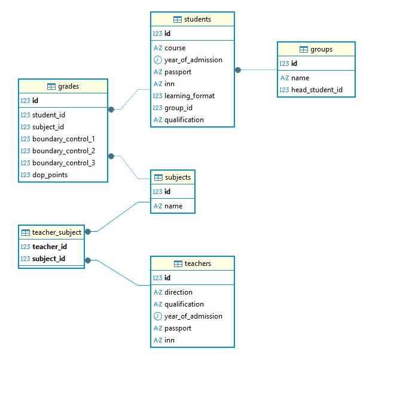

**students**
| name | type | comment| Description |
|-|-|-|-|
| id | int | UNSIGNED NOT NULL AUTO_INCREMENT PRIMARY KEY | создаёт уникальный id студента | 
| course | CHAR(1) | NOT NULL DEFAULT '1' | Указывает курс студента(используется char тк это 1 байт) |
| year_of_admission | date | not_null | Дата поступления |
| pasport | CHAR(10) | NOT NULL UNIQUE | паспортные данные |
| inn | CHAR(12) | NOT NULL UNIQUE | инн студента |
| learning_format | BOOLEAN | NOT NULL | Формат обучения очный или? |
| group_id | INT | UNSIGNED NOT NULL | айди группы студента и ключ до таблицы group |
| qualification | VARCHAR(20) | NOT NULL | квалификация по балонской системе  |

**subjects**
| name | type | comment| Description |
|-|-|-|-|
| id  | INT UNSIGNED |  NOT NULL AUTO_INCREMENT PRIMARY KEY | поле айди для таблицы предметов | 
| name | VARCHAR(255) | NOT NULL | название предмета |

**groups**
| name | type | comment| Description |
|-|-|-|-|
| id  | int |  UNSIGNED NOT NULL AUTO_INCREMENT PRIMARY KEY | айди группы | 
| name | VARCHAR(20) | NOT NULL | название группы |
| head_student_id | int | UNSIGNED UNIQUE | айди старосты группы |

**teachers**
| name | type | comment| Description |
|-|-|-|-|
| id | int | UNSIGNED NOT NULL AUTO_INCREMENT PRIMARY KEY | создаёт уникальный id преподователя | 
| year_of_admission | date | not_null | Дата найма |
| pasport | CHAR(10) | NOT NULL UNIQUE | паспортные данные |
| inn | CHAR(12) | NOT NULL UNIQUE | инн студента |
| qualification | VARCHAR(20) | NOT NULL | квалификация по балонской системе  |

**grades**
| name | type | comment| Description |
|-|-|-|-|
| id  | int |  UNSIGNED NOT NULL AUTO_INCREMENT PRIMARY KEY | айди группы | 
| student_id | INT UNSIGNED | NOT NULL | айди студента из таблицы студента |
| subject_id | INT UNSIGNED | NOT NULL | айди предмета из таблицы предеты |
| boundary_control_1 | INT UNSIGNED | DEFAULT 0 | баллы за 1 рубежный |
| boundary_control_2 | INT UNSIGNED | DEFAULT 0 | баллы за 2 рубежный |
| boundary_control_3 | INT UNSIGNED | DEFAULT 0 | баллы за 3 рубежный |
| dop_points | INT UNSIGNED | DEFAULT 0 | доп баллы |
| student_id | INT | NOT NULL | название группы |
| head_student_id | int | UNSIGNED UNIQUE | айди старосты группы |

**teacher_subject**
| name | type | comment| Description |
|-|-|-|-|
| teacher_id  | INT UNSIGNED |  NOT NULL |  айди преподователя из таблицы преподователь | 
| subject_id | INT UNSIGNED | NOT NULL |  айди предмета из таблицы предеты |

